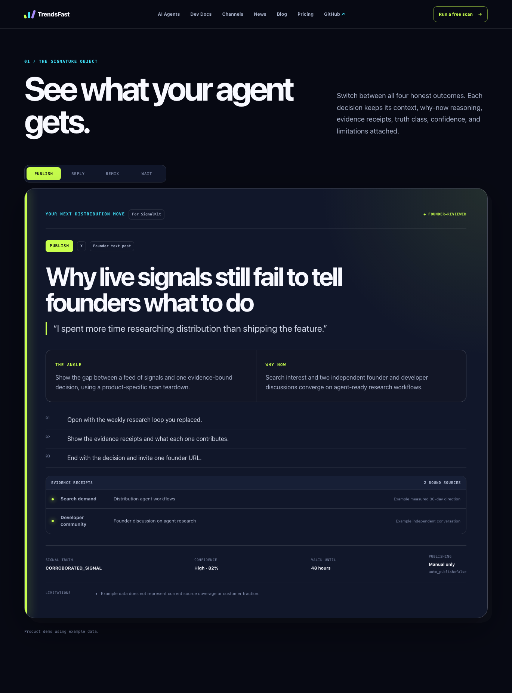

# TrendsFast

[](https://github.com/meestierolff/trendsfast/actions/workflows/ci.yml)
[](LICENSE)

> **The social and search trend intelligence API for founders, creator-led
> brands, and their AI agents.**

## Spot the trends your users care about. Know what to distribute next.

Paste a product URL. Find relevant trends and content opportunities fast. Know
exactly what to publish, where to publish it, which conversation to reply to,
what to remix, or what to wait on.

TrendsFast understands bounded product context, watches live social and search
signals, and gives a founder or AI agent one evidence-backed **Next Move**—with
a channel, format, hook, tone, target, and honest time window.

**Replace hours of manual distribution research with one relevant,
evidence-backed action a founder can actually take.** Reach the right users
before the moment passes—without chasing irrelevant hype.

[Run the fixture locally](#fixture-quick-start) ·
[Read the developer contract](docs/features/007-rest-api-and-api-keys.md) ·
[View the source ledger](docs/providers/SOURCE_RIGHTS_MATRIX.md)

> **Hosted scan CTA pending.** DNS and deployment are not verified, so this
> README does not link a public scan URL. Add it only when the current
> [release report](docs/operations/RELEASE_REPORT_TEMPLATE.md) records the
> verified canonical deployment.



_Real local production-artifact capture. The card and footer visibly identify
example data; this is not live-source, deployment, customer, or traction proof._

Social listening gives you a feed. Trend dashboards give you charts. Raw APIs
give you JSON. **TrendsFast gives your agents the next move.**

Every completed scan returns exactly one founder-reviewed action:

- `PUBLISH` — make a product-credible contribution backed by sufficient evidence;
- `REPLY` — join one unusually relevant conversation while it is still useful;
- `REMIX` — translate a working topic or format without copying it;
- `WAIT` — protect credibility when the evidence does not clear the quality floor.

Founder-reviewed. No auto-posting. No card for the free scan. Private by
default. Open source.

## Fixture quick start

Prerequisites: Node.js 22+, pnpm 9+, Docker with Compose, and ports `3000` and
`54329` available.

```bash
cp .env.example .env
pnpm install --frozen-lockfile
docker compose up -d postgres
pnpm db:migrate
pnpm db:seed
pnpm dev
```

Open [http://localhost:3000](http://localhost:3000) and keep
`PROVIDER_CREDENTIAL_MODE=fixture`. Fixture mode exercises the product contract
without paid credentials or provider network calls. It is example behavior, not
a live-source read-back.

Stop the app with `Ctrl-C`; stop PostgreSQL with `docker compose down`. Add `-v`
only when you intentionally want to delete local database data. See
[self-hosting](SELF_HOSTING.md) and the
[environment reference](docs/operations/ENVIRONMENT.md) for the full setup.

## API example

After claiming a private result, an entitled owner can create a named,
show-once, project-scoped key in **Dashboard → Agents**. Anonymous free scans do
not receive a reusable API key. Keep the endpoint local until a deployment is
verified. The preferred route loads the claimed project's saved URL, context,
voice, and capability ceiling server-side:

```bash
export APP_URL=http://localhost:3000
export PROJECT_ID=replace-with-claimed-project-uuid
export TRENDSFAST_API_KEY=replace-with-your-project-scoped-key

curl -sS "$APP_URL/v1/projects/$PROJECT_ID/next-move" \
  -H "Authorization: Bearer $TRENDSFAST_API_KEY" \
  -H "Idempotency-Key: 4a2d1201-9666-4ef0-90a9-e5aa47786c8e" \
  -H "Content-Type: application/json" \
  --data "{
    \"objective\": \"Grow among technical founders\",
    \"preferred_channels\": [\"x\", \"linkedin\"],
    \"content_capabilities\": [\"founder_text\", \"screen_recording\"],
    \"generation_level\": \"brief\"
  }"
```

A newly accepted scan returns `202` and a status URL:

```json
{
  "id": "scan_<opaque-capability>",
  "status": "QUEUED",
  "status_url": "http://localhost:3000/v1/next-moves/scan_<opaque-capability>",
  "poll_after_seconds": 30
}
```

Poll with the same key after `poll_after_seconds`; use exponential backoff and
honor `Retry-After` on `429`:

```bash
export SCAN_ID=replace-with-id-from-the-create-response

curl -sS "$APP_URL/v1/next-moves/$SCAN_ID" \
  -H "Authorization: Bearer $TRENDSFAST_API_KEY"
```

Creation returns `200` when a suitable fresh result is already ready or `202`
when work is accepted. Polling returns `200` with `QUEUED`, `RUNNING`,
`REVIEW_REQUIRED`, `READY`, or `FAILED` in the body. The runtime OpenAPI 3.1
document is at `$APP_URL/v1/openapi.json`. The seeded fixture key is deliberately
bound to its seeded project, so substituting a different `PROJECT_ID` correctly
returns `403`. The legacy `POST /v1/next-move` remains available for compatible
project-bound clients that supply `product_url`; it returns the same strict
ready-result contract.

## What a Next Move contains

A result includes the relevant opportunity, one immutable action, its
action-specific production detail, a rounded trend window, categorical
BreakoutPotential, why now, exact evidence receipts, freshness, limitations,
and founder-review state. `brief` is already actionable; `draft` may add prose
for PUBLISH or REMIX without changing the action, evidence, timing, or score.
BreakoutPotential is not a probability.

```json
{
  "id": "scan_example",
  "status": "READY",
  "contract_version": "next-move-v1",
  "generation_level": "brief",
  "project": {
    "name": "Example",
    "url": "https://example.com",
    "audience": "Technical founders",
    "problem": "Distribution research is fragmented",
    "credible_topics": ["evidence-led distribution"],
    "assumptions": ["Example context only"]
  },
  "next_move": {
    "action": "WAIT",
    "channel": "none",
    "topic": "No opportunity clears the quality floor",
    "angle": "Hold the draft until an independent signal appears.",
    "format": "none",
    "hook": "Do not force a post from thin evidence.",
    "outline": ["Recheck the strongest query in 72 hours."],
    "priority": 0,
    "confidence": 0.74,
    "valid_until": "2026-08-14T10:00:00.000Z"
  },
  "action_details": {
    "action": "WAIT",
    "considered_opportunity": "A single-source discussion about distribution agents",
    "failure_reasons": ["DEPENDENT_EVIDENCE", "WEAK_EVIDENCE"],
    "do_not_act_on": ["Do not present this discussion as a corroborated trend yet."],
    "watch_conditions": ["Recheck when an independent current source confirms the topic."],
    "recheck_at": "2026-08-13T22:00:00.000Z"
  },
  "trend_window": {
    "state": "UNKNOWN",
    "basis": "UNKNOWN",
    "observed_since": "2026-08-13T07:00:00.000Z",
    "last_confirmed_at": "2026-08-13T09:00:00.000Z",
    "valid_until": "2026-08-14T10:00:00.000Z",
    "recheck_at": "2026-08-13T22:00:00.000Z",
    "confidence": 0.35,
    "explanation": "The stored evidence does not support a defensible remaining-duration estimate."
  },
  "breakout_potential": {
    "level": "unknown",
    "basis": "INSUFFICIENT_DATA",
    "factors": {
      "audience_relevance": 0.63,
      "timing": 0.41,
      "novelty": 0.58,
      "product_credibility": 0.52,
      "format_fit": 0.7,
      "saturation_risk": 0.2
    },
    "explanation": "The label is unknown because the evidence is insufficient; it is not a probability."
  },
  "freshness": {
    "state": "CURRENT",
    "evaluated_at": "2026-08-13T10:00:00.000Z",
    "requires_new_scan": false
  },
  "why_now": {
    "summary": "Available example signals share one origin.",
    "signal_class": "INSUFFICIENT_SIGNAL",
    "independent_source_count": 1,
    "saturation": "unknown"
  },
  "evidence": [
    {
      "source": "hacker_news",
      "url": "https://news.ycombinator.com/item?id=44123123",
      "title": "A stored founder discussion",
      "published_at": "2026-08-13T07:00:00.000Z",
      "observed_at": "2026-08-13T09:00:00.000Z",
      "reason": "The exact stored discussion is relevant but not independently corroborated.",
      "provider": "hn_algolia",
      "role": "DECISION_SUPPORT",
      "verified": true,
      "availability": "AVAILABLE"
    }
  ],
  "limitations": ["One-source evidence cannot support a trend claim."],
  "founder_reviewed": true,
  "auto_publish": false
}
```

`WAIT` is a trustworthy result, not an error. A recent popular post is not called
a trend unless the evidence meets the explicit truth model. At `valid_until`,
the same response is labeled `STALE` with `requires_new_scan=true`.

## Architecture at a glance

```text
URL/request
  -> product context
  -> bounded provider adapters (fixture | managed | byok)
  -> canonical signals and immutable evidence receipts
  -> deterministic clustering/ranking and WAIT gates
  -> constrained synthesis
  -> founder review
  -> private delivery and feedback
```

The model may refine language, but it may not change the deterministic action or
evidence set, or invent URLs, metrics, or source claims. Flat, declining, or
unrelated measurements cannot become measured momentum. See the
[architecture](docs/architecture/OVERVIEW.md),
[product constitution](docs/PRODUCT_CONSTITUTION.md), and
[threat model](docs/security/THREAT_MODEL.md).

## Repository map

```text
apps/web/               web product, founder operations, and REST API
packages/core/          product and lifecycle contracts
packages/schemas/       runtime validation and OpenAPI schemas
packages/database/      PostgreSQL schema, migrations, and repositories
packages/providers/     bounded provider adapters and fixtures
packages/scoring/       deterministic ranking and quality floors
packages/evidence/      evidence binding and validation
packages/orchestration/ resumable scan execution
packages/billing/       disabled-by-default Stripe boundary
packages/analytics/     first-party event contracts
docs/                   architecture, features, operations, and launch assets
```

## Credential modes

| Mode      | Intended use                       | Credential owner |
| --------- | ---------------------------------- | ---------------- |
| `fixture` | Local demo and deterministic tests | None             |
| `managed` | TrendsFast Cloud                   | Cloud operator   |
| `byok`    | Self-hosting                       | Self-hoster      |

Managed credentials must never reach browser code, tenants, logs, or database
rows. Self-hosted keys are server environment variables. Missing optional
sources must degrade coverage instead of fabricating results.

## Source truth

The adapter panel includes product-site context, X through xAI, Google Trends
through DataForSEO, Hacker News through Algolia, GitHub's public API, Tavily,
YouTube, and founder-entered public evidence. That is not a claim that a source
has passed a deployed read-back.

| Evidence path            | Public label until deployed proof | Engineering truth                    |
| ------------------------ | --------------------------------- | ------------------------------------ |
| Repository example data  | Product demo                      | Deterministic fixture path           |
| External source adapters | Coming soon                       | No production read-back committed    |
| Manual founder evidence  | Coming soon                       | Callable supplemental ops entry      |
| Reddit automation        | Permission required               | No automated ingestion; legal review |

The public product uses only **Connected**, **Limited**, **Coming soon**,
**Unavailable**, and **Permission required**; operations retain the exact
technical state and read-back record.

Only a dated production record with release and deployment identity, a bounded
source read-back, canonical URL, cost/quota, and limitations may upgrade an
external source to **Connected**. See the
[source-rights matrix](docs/providers/SOURCE_RIGHTS_MATRIX.md) and
[setup checklist](docs/providers/SETUP_CHECKLIST.md).

## Current release truth

- No production deployment, provider/model read-back, legal approval, customer
  result, dogfood outcome, or traction metric is claimed by this README. A
  protected preview has separate dated evidence below; it is not a public or
  production launch.
- Founder review now includes evidence verification/rejection, immutable-action
  edit-and-approve, context correction, stored-evidence recomputation, delivery,
  and redacted JSON/Markdown review bundles. Stored-only recomputation makes no
  provider/model call and renewed evidence review is required after correction.
- Hosted public/API admission and provider-spend limits come only from ignored
  private policy. Missing private policy or a disabled provider-call gate stops
  new paid work before database admission or provider I/O; polling does not
  consume a research allowance.
- Public scans, live API creation, and Checkout each have a separate default-off
  kill switch so a hosted preview can boot without enabling customer effects.
- Protected founder operations can issue a revocable, audited, one-project
  design-partner grant for at most 30 days. It is explicitly not a Stripe
  subscription, and normal usage/cost limits still apply.
- Managed/provider/model prices and cost ceilings are server configuration, not
  committed TrendsFast economics. Managed mode fails closed when an applicable
  value is missing; fixture cost is $0; unknown actual usage stays conservatively
  unsettled. See the [commercial boundary](docs/COMMERCIAL_BOUNDARY.md).
- Billing and paid monitoring remain disabled unless every code, sandbox,
  hosted, monitoring, legal, tax, and founder-approval gate is verified. The
  code-local boundary uses Stripe Node `^22.4.0`, API version
  `2026-07-29.dahlia`, hosted subscription Checkout, verified webhooks, a hashed
  one-time checkout claim, exactly-once project key issuance, and Stripe-hosted
  Portal access. No current Stripe Product or Price ID, application journey, or
  live-mode result is claimed: the previously used sandbox key must first be
  rotated and the CLI reauthenticated.
- The first-party ledger is the intended analytics truth. Public/open metrics
  stay placeholder-only until a reproducible denominator-backed report exists.
- Historical implementation candidate `73297a6cfdc99b025990b001b39cef399f4d235e`
  replayed all 18 migration files through `0019` (intentional `0009`/`0010`
  gaps), matched every hash, seeded twice, and passed strict verification for
  37/37 public tables plus columns, enums, indexes, constraints, and denied
  browser/default grants. The database-enabled suite passed 98 files/512 tests;
  the non-database run passed 78 files/455 tests with 20 files/57 tests skipped.
- Typecheck, lint, Drizzle check, and the optimized webpack production build
  passed; the build emitted 37 route/page entries. The production artifact
  passed 58 Playwright checks with two intentional mobile skips, including 24
  desktop/mobile axe checks. The local deployment verifier passed 26 routes and
  two private unknown-capability `404` probes, and the retention purge finished
  with zero eligible backlog. The default Turbopack build was blocked locally by
  sandbox port restrictions. GitHub Actions then passed the standard verify,
  migration, seed, build, and critical-browser jobs for branch commit
  `4ec9510f610001285c54947326c65cb79a075f37` in
  [CI run 31585349262](https://github.com/meestierolff/trendsfast/actions/runs/31585349262).
- The product-completion release candidate has separate local evidence: an
  isolated PostgreSQL 16.14 database applied 23/23 migration files through
  `0024` and seeded; the initial strict verifier matched 44/44 tables; the full
  database run passed 710 tests with 5 skipped; and the runtime-role integration
  passed 5/5 tests. Eight roles were provisioned (migrator plus seven scoped
  runtimes), and all seven runtime connections passed catalog-only verification
  with no row values read. Exact release-candidate SHA
  `91374fcb357f576de7a35bbbac4f684c1e9a5317` subsequently passed CI, CodeQL,
  dependency review, and secret-history checks; the dated hosted record keeps
  those immutable results separate from this local run.
- The same release candidate implements strict `next-move-v1`, bounded product
  context/provenance, Supabase Google/magic-link application flows, secure
  project claims, the Today/Projects/History/Agents/Billing dashboard, owner
  key self-service, the preferred claimed-project API route, and an ops-only
  retention cron. None of those code-local surfaces is a hosted Auth, API, or
  operational read-back.
- Provider and model attempts reserve their bounded cost durably before I/O.
  Valid provider-reported usage settles the reservation; missing usage remains
  conservative and unsettled. Public replay attempts consume the durable daily
  admission cap.
- Isolated Free Supabase preview project `auxienkuufejeakaczlq` now has 23/23
  unseeded migrations, strict schema/ownership/Data API denial verification,
  and seven TLS-verified runtime identities. Protected Hobby Vercel deployment
  `dpl_8vpd6yDUSVxn9oNH5SobuJWXuN6q` is `READY` at the stable
  `trendsfast-preview.vercel.app` alias with all customer-effect switches
  disabled. Authenticated route/API probes passed for the exact release SHA.
  This does not prove an anonymous public origin, production, provider/model
  access, managed policy, monitoring, backup/restore, Auth journeys, or
  dogfood. Production still requires Vercel Pro and a Supabase Pro project;
  `trendsfast.com` is registered but not connected or verified.
- Retention now has an authenticated ops-only route, a daily ops deployment
  template, aggregate health/alerts, and a dedicated least-privilege database
  role. Scheduler deployment/success, backup expiry, legal holds, and operator
  privacy-request acceptance remain unverified.
- Explicit non-fixture retry after an uncertain provider effect or charge
  requires operator reconciliation; no broad retry-safety claim is made.

The immutable historical baseline and the newer local results remain
`LOCAL_PASS`; they are not upgraded by the separate protected-preview evidence.
See the
[2026-08-12 historical record](docs/operations/LOCAL_VERIFICATION_2026-08-12.md),
[2026-08-13 local product-completion record](docs/operations/LOCAL_VERIFICATION_2026-08-13.md),
the
[2026-08-13 protected hosted-preview record](docs/operations/HOSTED_PREVIEW_VERIFICATION_2026-08-13.md),
and [launch checklist](docs/operations/LAUNCH_CHECKLIST.md). Every applicable
production, external, and founder-approval gate remains separate.

## Verification

```bash
pnpm lint
pnpm typecheck
pnpm test
pnpm build
# Browser dependencies are required before:
pnpm test:e2e
```

`pnpm verify` runs lint, typecheck, unit/contract tests, and the production build.
Database integration tests require migrated PostgreSQL and
`RUN_DATABASE_INTEGRATION=1`. These commands do not prove deployment, live
provider health, legal permission, customer outcomes, or paid-billing readiness.

## Self-hosted and cloud

The self-hosted build contains the decision engine and works with standard
PostgreSQL. Self-hosters supply upstream credentials and accept each provider's
terms. TrendsFast Cloud is intended to add managed credentials, monitoring,
history, operations, cost control, and support—not a hidden replacement engine.
Read [SELF_HOSTING.md](SELF_HOSTING.md) and [CLOUD.md](CLOUD.md).

## Contributing, security, license, and marks

Start with [CONTRIBUTING.md](CONTRIBUTING.md). Report vulnerabilities privately
under [SECURITY.md](SECURITY.md); never open a public issue with a usable secret
or exploit. By participating, you agree to the
[Code of Conduct](CODE_OF_CONDUCT.md).

Code is licensed under the [GNU Affero General Public License v3.0 only](LICENSE),
unless a file says otherwise. The license does not grant permission to use the
TrendsFast name, logo, or brand; see [TRADEMARK.md](TRADEMARK.md).
